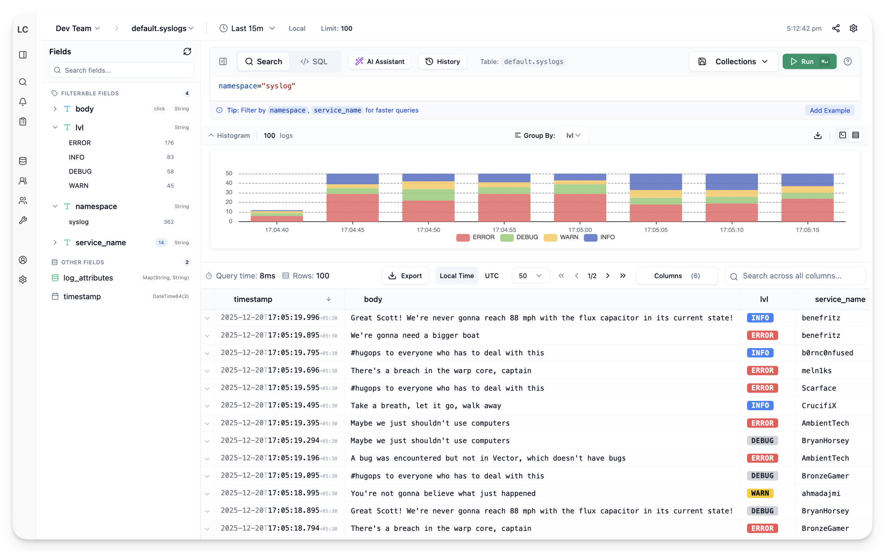
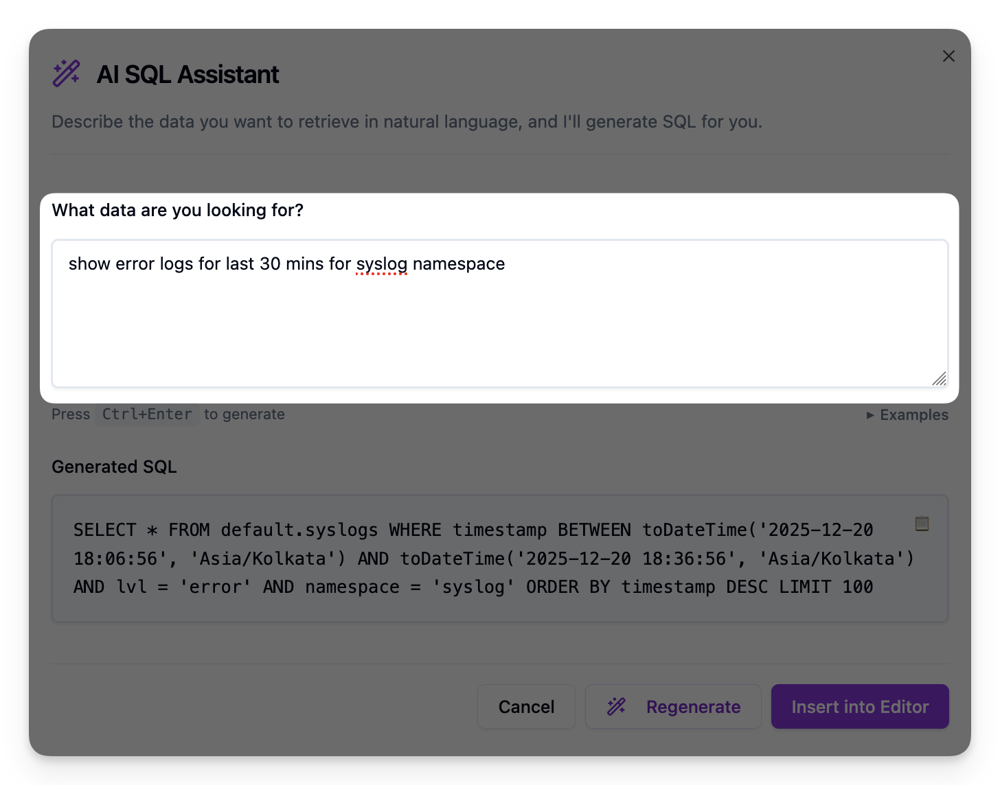
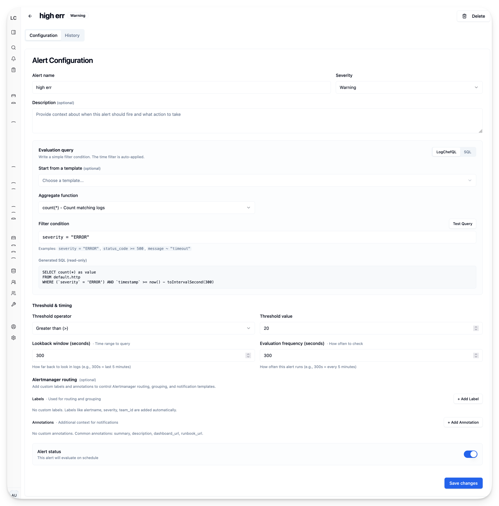
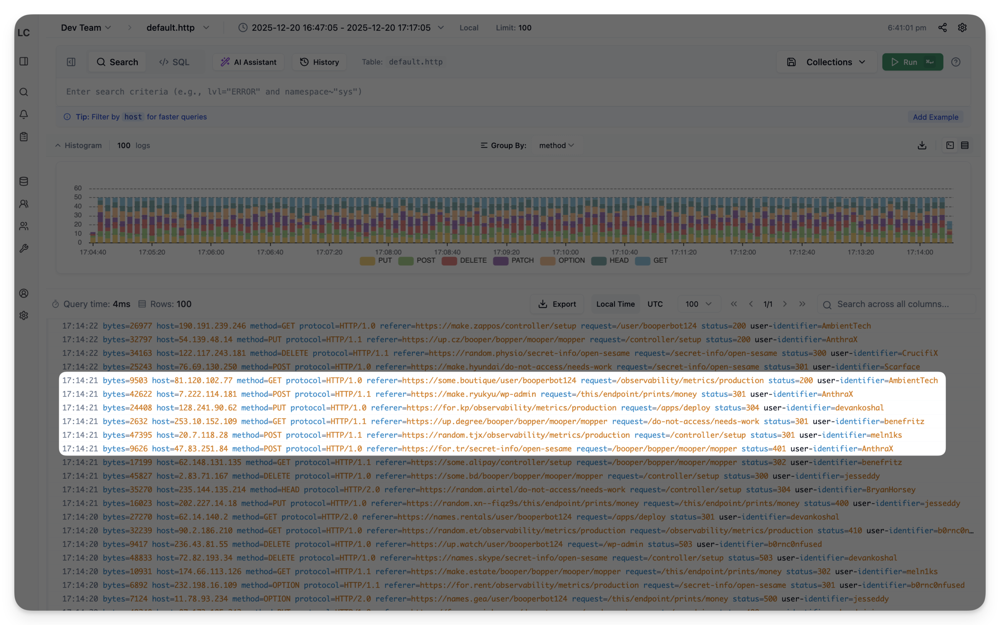
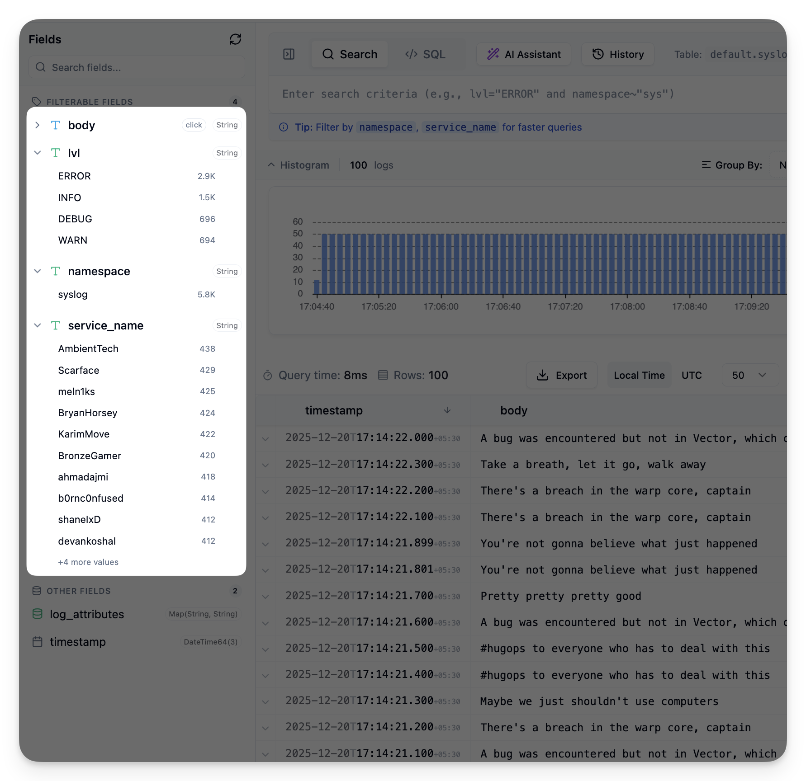

<a href="https://zerodha.tech"></a>

<p align="center"></p>

<p align="center">A modern, single binary, multi-datasource log analytics platform</p>

<p align="center">
  <a href="https://demo.logchef.app"><strong>Try Demo</strong></a> ·
  <a href="https://logchef.app"><strong>Read Documentation</strong></a> ·
  <a href="https://mrkaran.dev/posts/announcing-logchef/"><strong>Announcement Blog Post</strong></a>
</p>

<p align="center">
  
</p>

Logchef is a lightweight log analytics platform for teams that want a strong query and control plane on top of existing log backends. It runs as a single binary and currently supports both ClickHouse and VictoriaLogs as datasource backends, while providing a unified UI for exploration, saved queries, alerting, and access control.

## Features

- **Query-first log exploration**: Fast filtering with LogchefQL plus native SQL or LogsQL depending on the source.
- **AI Query Assistant**: Turn natural language into ClickHouse SQL instantly.
- **Real-time alerting**: Schedule rules and send email or webhook notifications.
- **OIDC + RBAC included**: SSO and team-based access out of the box.
- **Datasource-first**: Connect ClickHouse tables or VictoriaLogs instances without reshaping your storage layer.
- **Single binary**: One executable, no runtime dependencies.
- **Comprehensive metrics**: Prometheus metrics for usage and performance.
- **MCP integration**: Model Context Protocol server for AI assistants ([logchef-mcp](https://github.com/mr-karan/logchef-mcp)).
- **CLI**: Query logs from your terminal with syntax highlighting and multi-context support.

## Quick Start

### Docker

```shell
# Download the Docker Compose file
curl -LO https://raw.githubusercontent.com/mr-karan/logchef/refs/heads/main/deployment/docker/docker-compose.yml

# Start the services
docker compose up -d
```

Access the Logchef interface at `http://localhost:8125`.

## CLI

Logchef includes a powerful CLI for querying logs directly from your terminal.

### Install

Download the latest release for your platform from [GitHub Releases](https://github.com/mr-karan/logchef/releases?q=cli&expanded=true):

```bash
# macOS (Apple Silicon)
curl -LO https://github.com/mr-karan/logchef/releases/download/cli-v0.1.1/logchef-darwin-arm64.tar.gz

# macOS (Intel)
curl -LO https://github.com/mr-karan/logchef/releases/download/cli-v0.1.1/logchef-darwin-amd64.tar.gz

# Linux (x86_64)
curl -LO https://github.com/mr-karan/logchef/releases/download/cli-v0.1.1/logchef-linux-amd64.tar.gz

# Linux (ARM64)
curl -LO https://github.com/mr-karan/logchef/releases/download/cli-v0.1.1/logchef-linux-arm64.tar.gz

# Extract and install
tar -xzf logchef-*.tar.gz
sudo mv logchef /usr/local/bin/
```

### Usage

```bash
# Authenticate with your Logchef server
logchef auth --server https://logs.example.com

# Query logs with LogchefQL
logchef query "level:error" --since 1h

# Execute a raw native query (SQL for ClickHouse, LogsQL for VictoriaLogs)
logchef sql "SELECT * FROM logs.app WHERE level='error' LIMIT 10"
logchef sql 'level:="error" | fields _time, _msg, service'
```

For full documentation, see the [CLI Guide](https://logchef.app/integration/cli/).

## Documentation

For comprehensive documentation, including setup guides, configuration options, and API references, please visit [logchef.app](https://logchef.app).

## Contributing

We welcome contributions! To get started:

1. **Development Setup**: See our [Development Setup Guide](https://logchef.app/contributing/setup) or use the Nix flake:
   ```bash
   nix develop
   just sqlc-generate
   just dev-docker
   just build
   ```

2. **Read the Guidelines**: Check [CONTRIBUTING.md](./CONTRIBUTING.md) for detailed contribution guidelines

3. **Find an Issue**: Look for issues labeled `good first issue` or `help wanted`

4. **Make Your Changes**: Follow our coding standards and run `just check` before submitting

For questions or help, open an issue or start a discussion on GitHub.

## Screenshots









## License

Logchef is distributed under the terms of the AGPLv3 License.

### Credits

The Logchef logo was designed by [Namisha Katira](https://www.behance.net/katiranimi015d).
