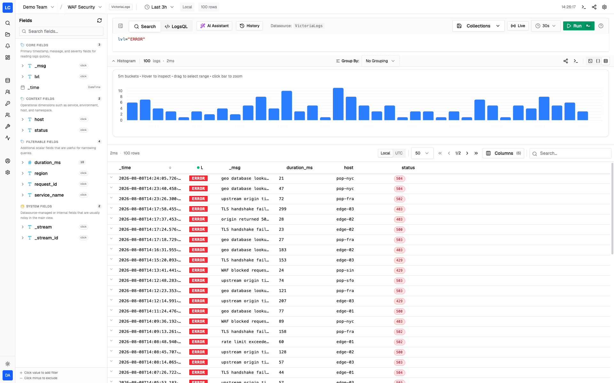
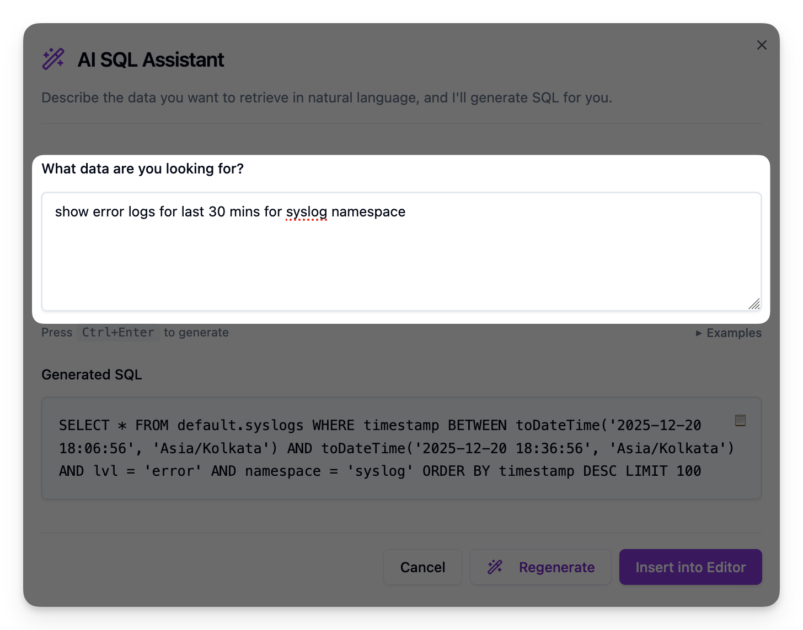
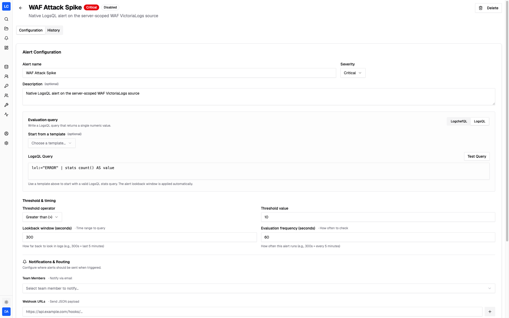
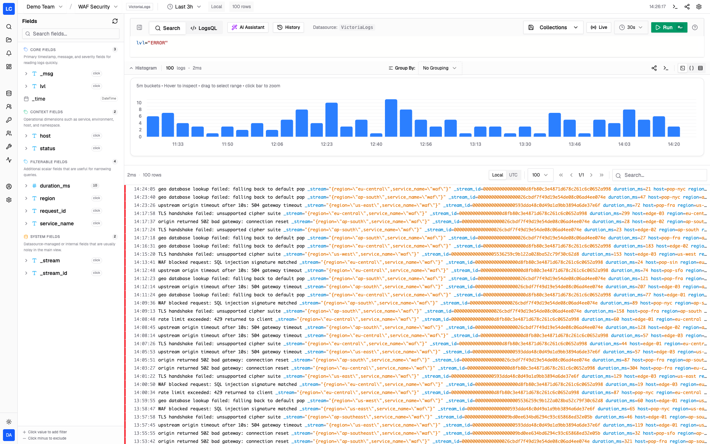
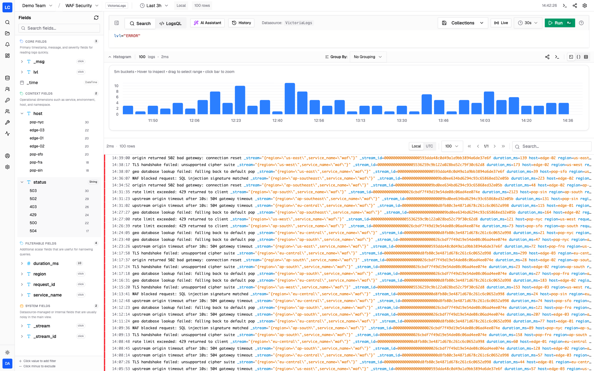

<a href="https://zerodha.tech"></a>

<p align="center"></p>

<p align="center"><strong>The open-source log workspace for ClickHouse and VictoriaLogs.</strong><br />Search, live tail, dashboards, alerts, and access control in one self-hosted binary.</p>

<p align="center">
  <a href="https://demo.logchef.app"><strong>Try Demo</strong></a> ·
  <a href="https://logchef.app"><strong>Read Documentation</strong></a> ·
  <a href="https://logchef.app/changelog/#v2.0.0"><strong>What's new in v2.0</strong></a>
</p>

<p align="center">
  
</p>

Logchef is a lightweight, self-hosted log analytics and observability platform for teams that want a strong query and control plane on top of the log backends they already run. Connect ClickHouse, VictoriaLogs, or both. Logchef gives them one workflow for exploration, dashboards, saved queries, alerting, and access control — without moving or reshaping your data.

If you are evaluating VictoriaLogs specifically, start with the [VictoriaLogs guide](https://logchef.app/tutorials/victorialogs/).

## Logchef 2.0

Version 2.0 is a major expansion of what Logchef can sit in front of and what teams can do once it is there:

- **VictoriaLogs is a first-class datasource.** Use the same LogchefQL search workflow across backends, drop into native LogsQL when you need it, and carry source-level auth, tenant headers, and immutable scope through every query.
- **Build real operational dashboards.** Mix ClickHouse and VictoriaLogs panels on one grid, drag and resize them in place, and choose time series, stat, breakdown, or table views.
- **Follow incidents as they unfold.** Live tail streams matching rows into the explorer and CLI on both backends, including native VictoriaLogs tailing.
- **Run without an identity provider.** Built-in email and password authentication works on its own or alongside OIDC; OIDC deployments can also auto-provision new users safely.
- **Investigate from the terminal.** The CLI understands both backends and includes query, native SQL/LogsQL, explain, histogram, fields, history, tail, doctor, and browser hand-off workflows.
- **Ship it with more confidence.** v2 adds dashboard caching, ClickHouse query guardrails, opt-in rate limiting, streaming for large ClickHouse results, and a broad security and reliability pass.

Read the [v2.0 release notes](https://logchef.app/changelog/#v2.0.0) or [try the live demo](https://demo.logchef.app).

## Features

- **Query-first log exploration**: Fast filtering with LogchefQL plus native SQL or LogsQL depending on the source.
- **Live tail**: Stream matching logs in real time from the explorer.
- **Dashboards**: Multi-panel views (time series, stat, breakdown, table) on a shared time range, with a direct-manipulation grid editor.
- **AI Query Assistant**: Turn natural language into LogchefQL, ClickHouse SQL, or LogsQL.
- **Scheduled alerting**: Evaluate source-aware rules and send email or webhook notifications.
- **OIDC or local auth + RBAC**: SSO out of the box, or run without an external identity provider using built-in email+password authentication.
- **Datasource-first**: Connect ClickHouse tables, VictoriaLogs instances, or both without reshaping your storage layer.
- **Single binary**: One executable, no runtime dependencies.
- **Pluggable metadata store**: Zero-config SQLite by default; opt into [Postgres](https://logchef.app/operations/database-backends/) for multi-replica high availability.
- **Comprehensive metrics**: Prometheus metrics for usage and performance.
- **MCP integration**: Model Context Protocol server for AI assistants ([logchef-mcp](https://github.com/mr-karan/logchef-mcp)).
- **CLI**: Query logs from your terminal with syntax highlighting and multi-context support (query, explain, histogram, tail, doctor, and more).

## Quick Start

### Docker

```shell
# Download the Docker Compose file
curl -LO https://raw.githubusercontent.com/mr-karan/logchef/refs/heads/main/deployment/docker/docker-compose.yml

# Start the services
docker compose up -d
```

Access the Logchef interface at `http://localhost:8125`.

## CLI

Logchef includes a cross-platform CLI for querying and investigating logs directly from your terminal.

### Install

Find the latest CLI version on the [releases page](https://github.com/mr-karan/logchef/releases?q=cli&expanded=true), then set `CLI_VERSION` and download the build for your platform:

```bash
# Set to the latest cli-v* version from the releases page
CLI_VERSION="0.2.1"
BASE=https://github.com/mr-karan/logchef/releases/download/cli-v${CLI_VERSION}

# macOS (Apple Silicon)
curl -LO $BASE/logchef-cli_${CLI_VERSION}_macos-aarch64.tar.gz

# macOS (Intel)
curl -LO $BASE/logchef-cli_${CLI_VERSION}_macos-x86_64.tar.gz

# Linux (x86_64)
curl -LO $BASE/logchef-cli_${CLI_VERSION}_linux-x86_64-musl.tar.gz

# Linux (ARM64)
curl -LO $BASE/logchef-cli_${CLI_VERSION}_linux-aarch64-musl.tar.gz

# Extract and install
tar -xzf logchef-cli_*.tar.gz
sudo mv logchef /usr/local/bin/
```

### Usage

```bash
# Authenticate with your Logchef server
logchef auth --server https://logs.example.com

# Query logs with LogchefQL
logchef query 'level="error"' --since 1h

# See the generated SQL/LogsQL without running it
logchef explain 'level="error"'

# Counts over time (terminal bar chart)
logchef histogram 'level="error"' --since 1h

# Diagnose your setup (config, auth, server, defaults)
logchef doctor

# Execute a raw native query (SQL for ClickHouse, LogsQL for VictoriaLogs)
logchef sql "SELECT * FROM logs.app WHERE level='error' LIMIT 10"
logchef sql 'level:="error" | fields _time, _msg, service'
```

For full documentation, see the [CLI Guide](https://logchef.app/integration/cli/).

## Documentation

For comprehensive documentation, including setup guides, configuration options, and API references, please visit [logchef.app](https://logchef.app).

## Contributing

We welcome contributions! To get started:

1. **Development Setup**: See our [Development Setup Guide](https://logchef.app/contributing/setup):
   ```bash
   just sqlc-generate
   just dev-docker
   just build
   ```

2. **Read the Guidelines**: Check [CONTRIBUTING.md](./CONTRIBUTING.md) for detailed contribution guidelines

3. **Find an Issue**: Look for issues labeled `good first issue` or `help wanted`

4. **Make Your Changes**: Follow our coding standards and run `just check` before submitting

For questions or help, open an issue or start a discussion on GitHub.

## Screenshots









## License

Logchef is distributed under the terms of the AGPLv3 License.

### Credits

The Logchef logo was designed by [Namisha Katira](https://www.behance.net/katiranimi015d).
