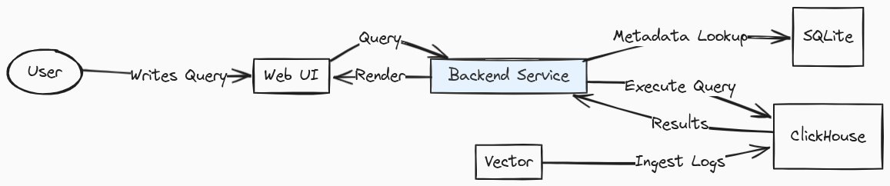

## Architectural Overview

Logchef is a specialized query and visualization layer on top of external log storage backends. Its design keeps a clear separation of concerns:

- **Query Engine**: Core focus on transforming user intent into the selected datasource's native query language
- **No Ingestion Pipeline**: The architecture intentionally excludes log collection and focuses only on the query interface
- **Datasource Providers**: Backend-specific provider layers for ClickHouse and VictoriaLogs while keeping a shared application control plane

This means Logchef can reuse the existing ecosystem of log collection tools while giving you a dedicated interface for exploring logs once they land in ClickHouse, VictoriaLogs, or future supported backends.

## System Overview

### Technology Stack

#### Backend

- **Go**: Logchef's core backend is written in Go for performance and concurrency
- **SQLite**: Lightweight database used for metadata storage of users, teams, sources, and saved queries
- **ClickHouse**: High-performance columnar database optimized for analytical queries on log data
- **VictoriaLogs**: Log-native storage engine accessed via LogsQL and HTTP APIs

#### Frontend

- **Vue.js**: Modern JavaScript framework used to build the reactive user interface
- **Tailwind CSS**: Utility-first CSS framework for styling the UI components

## Core Components

### 1. Query Engine

- Converts LogchefQL to the selected datasource's native query language
- Manages query execution across multiple sources
- Supports both simple search syntax and datasource-native query modes for complex queries

### 2. Authentication Service

- Integrates with OIDC providers (like Keycloak, Zitadel etc)
- Manages user sessions and authorization
- Enforces role-based access control

### 3. Source Manager

- Manages connections to remote datasource backends
- Handles source registration and validation
- Provides connection pooling mechanisms

## Data Flow

1. **Log Ingestion** (external to Logchef):

   - Various collectors (Vector, Filebeat, etc.) send logs to ClickHouse, VictoriaLogs, or other storage systems outside Logchef
   - Each collector handles its own schema mapping and transformations

2. **Log Querying** (Logchef's domain):
   - Users construct queries via the UI (LogchefQL or native mode)
   - Logchef translates LogchefQL to SQL for ClickHouse or LogsQL for VictoriaLogs
   - Queries are executed against the appropriate datasource source(s)
   - Logchef processes, formats, and displays the results in the UI

## Data Storage

### SQLite Metadata Store

SQLite manages all system configuration and relationships:

- **Sources**: Connection details and metadata for remote datasource backends
- **Users**: Account information and authentication data
- **Teams**: Organizational units with role-based access
- **Saved Queries**: Team-specific saved queries with explicit query language and editor mode metadata

### Datasource Backends

Logchef connects to remote datasource backends as sources:

- **ClickHouse sources** can:

  - Use the default OTEL schema as-is
  - Customize the built-in OpenTelemetry (OTEL) schema
  - Use custom schemas

- **VictoriaLogs sources** can:

  - Connect directly to a VictoriaLogs base URL
  - Apply tenant headers and immutable scope filters
  - Use dynamically discovered fields instead of a fixed SQL schema

- **Requirements**:

  - ClickHouse requires a timestamp field (DateTime/DateTime64)
  - VictoriaLogs defaults to `_time`

- **Schema Agnostic**: Beyond the timestamp field, Logchef works with provider-specific field discovery and schema metadata

## Deployment Considerations

- **Single Binary**: Logchef runs as a lightweight single binary with minimal resource requirements
- **Stateless Operation**: Core application is stateless for horizontal scaling (only SQLite metadata is persistent)
- **Proxying**: Can be deployed behind reverse proxies like Nginx or Caddy

## Next steps

- See [Database Backends & High Availability](/operations/database-backends) for running more than one replica
- Review [ClickHouse Schema Design](/integration/schema-design) for the log table schema Logchef expects
- Check [Teams, Sources & Access Control](/core/user-management) for how access is scoped
